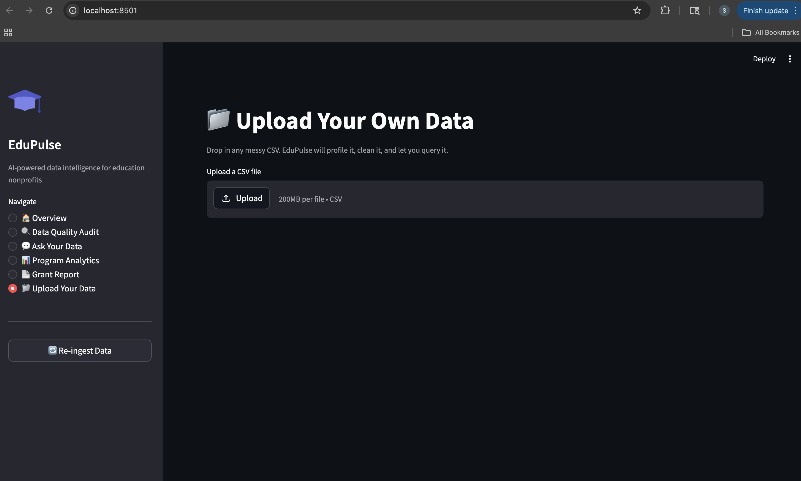

# EduPulse — AI-Powered Data Intelligence for Education Nonprofits

**Live Demo:** https://huggingface.co/spaces/Sakshi3027/edupulse

> Built to solve a real problem: education nonprofits are sitting on years of student data they can't use. No infrastructure, no pipelines, no way to ask questions of their own data. EduPulse changes that.

---

## The Problem This Solves

Education nonprofits collect student performance data, attendance logs, program outcomes, and grant metrics — across spreadsheets, CSVs, and manual exports. The data is messy, inconsistent, and siloed. They can't answer basic questions like *"which program drove the most math improvement?"* without hours of manual work.

This is exactly the kind of problem a Forward Deployed Engineer gets parachuted in to fix on day one.

---

## What EduPulse Does

- **Ingests messy CSVs** — inconsistent date formats, mixed grade level values, duplicate student records, attendance rates stored as both floats and percentage strings
- **Auto-cleans the data** — deduplication, normalization, null handling, all logged in an audit trail
- **Natural language queries with memory** — ask plain English questions, ask follow-ups, get SQL + results + auto-generated charts
- **Query retry logic** — if the LLM generates bad SQL, it automatically sends the error back and fixes it
- **AI-generated grant narratives** — pulls live stats and writes grant-ready program summaries
- **Data quality audit** — tells the org in plain English what's wrong with their data and what to fix
- **Upload your own CSV** — drop in any messy CSV, get an instant data profile, and query it in plain English

---

## Screenshots

### Overview Dashboard

*KPIs auto-calculated from cleaned data: 300 students served across 5 Chicago sites, +9.4pt average math growth, 69.9% attendance rate. Charts generated live from SQLite — no hardcoded numbers.*

---

### Ask Your Data — Conversation Memory

*Multi-turn conversation: ask a question, then ask follow-ups in context. "Which program has the highest math improvement?" → "Now show me just the students in that program" → "How many of them are in each grade level?" Each turn builds on the last.*

---

### Grant Report Generator

*One click pulls live stats from the database and generates a grant-ready 3-paragraph narrative. This is what a program director would paste directly into a funder report.*

---

### Data Quality Audit

*Automated audit across all tables. Completeness scores, null rates per column, overall health gauge. The AI narrative explains issues in plain English — written for a program director, not a data engineer.*

---

### Upload Your Own Data

*Drop in any CSV. EduPulse auto-profiles it: row count, health score, missing values by column, duplicate detection, unique value samples. Then load it into the query engine and ask questions in plain English.*

---

## The Data Reality (What Makes This Hard)

The synthetic dataset intentionally mirrors real nonprofit data chaos:

- Student names stored as `DOROTHY TAYLOR`, `cody ortiz`, `N. Smith`, `Hayes, Thomas`
- Dates: `August 19, 2023`, `09-23-2023`, `29 Nov 2014` — all in the same column
- Grade levels: `8th`, `Grade 10`, `senior`, `11` — four ways to say the same thing
- Attendance rate: `0.83` (float) AND `52%` (string) — same column
- ~15 duplicate student records with slightly different name formats
- 12–25% null rates across key fields
- Grants CSV uses different column names — won't join cleanly out of the box

---

## Tech Stack

| Layer | Tech |
|---|---|
| Backend | FastAPI + SQLite |
| LLM | Groq API (llama-3.1-70b) — free tier |
| NL → SQL | Schema-injected prompt + retry logic |
| Data Cleaning | pandas + custom normalization pipeline |
| Frontend | Streamlit |
| Charts | Plotly Express |
| Deployment | Hugging Face Spaces |

---

## Architecture
Raw CSVs (messy)
→ Ingestion + cleaning pipeline (cleaner.py)
→ SQLite database (auto-created)
→ FastAPI backend (7 endpoints)
→ Groq LLM (NL→SQL + insight generation)
→ Retry loop (auto-fixes bad SQL)
→ Streamlit frontend (6 pages)
→ Conversation memory (multi-turn queries)
→ Deployed on Hugging Face Spaces

---

## Features In Depth

### NL → SQL with Retry Logic
When the LLM generates SQL that fails, EduPulse automatically sends the error back to the model and asks it to fix the query — up to 3 attempts. Users never see a raw SQL error unless all 3 attempts fail.

### Conversation Memory
The Ask Your Data page maintains full conversation history. Each follow-up question gets the context of the previous question and result columns injected into the prompt, enabling analyst-style multi-turn conversations.

### CSV Upload + Profiling
Upload any CSV. EduPulse profiles it instantly — health score, null rates per column, duplicate detection, unique value sampling. Load it into the query engine and ask questions in plain English against your own data.

### Auto Data Cleaning
The cleaning pipeline handles: mixed date formats (8 formats supported), inconsistent grade level representations, status value normalization, boolean field standardization, attendance rate conversion (float ↔ percentage string), name format normalization, and duplicate record removal.

---

## Running Locally

```bash
# 1. Clone and set up
git clone https://github.com/Sakshi3027/edupulse.git
cd edupulse
python -m venv venv && source venv/bin/activate
pip install fastapi uvicorn pandas httpx streamlit plotly python-multipart aiofiles faker numpy

# 2. Generate synthetic data
python scripts/generate_data.py

# 3. Set Groq API key (free at console.groq.com)
export GROQ_API_KEY=your_key_here

# 4. Start backend (Terminal 1)
uvicorn backend.main:app --reload --port 8000

# 5. Start frontend (Terminal 2)
streamlit run frontend/app.py --server.port 8501
```

Open `localhost:8501` → click **Re-ingest Data** → explore all 6 pages.

---

## API Endpoints

| Method | Endpoint | Description |
|---|---|---|
| POST | `/ingest` | Load CSVs, clean, write to SQLite |
| GET | `/profile` | Data quality scores per table |
| POST | `/query` | NL → SQL → results (with retry) |
| GET | `/insights/overview` | KPIs + AI-generated narrative |
| GET | `/insights/data-quality-report` | LLM-narrated audit report |
| GET | `/schema` | Full DB schema with row counts |

---

## Project Structure
edupulse/
├── backend/
│   ├── main.py          # FastAPI app + all endpoints
│   ├── cleaner.py       # Data normalization pipeline
│   ├── database.py      # SQLite ingestion layer
│   └── config.py        # Environment config
├── frontend/
│   └── app.py           # Streamlit UI (6 pages)
├── scripts/
│   └── generate_data.py # Synthetic messy data generator
├── data/
│   └── raw/             # Generated CSVs
├── hf_deploy/
│   └── app.py           # Merged single-file HF deployment
└── assets/
└── screenshots/     # README screenshots

---

## Why I Built This

This project came from a clear observation: the hardest part of deploying AI in real organizations isn't the model — it's the data. Nonprofits and education orgs have years of valuable program data locked in inconsistent spreadsheets with no way to query it, visualize it, or use it to write grant reports.

EduPulse is the tool an FDE would build on-site in week one: ingest whatever mess exists, clean it automatically, and give non-technical staff a way to ask questions of their own data in plain English.

---

## Author

**Sakshi Chavan** — Data Scientist & Software Engineer
[GitHub](https://github.com/Sakshi3027) | [Email](mailto:sakshchavan30@gmail.com)
