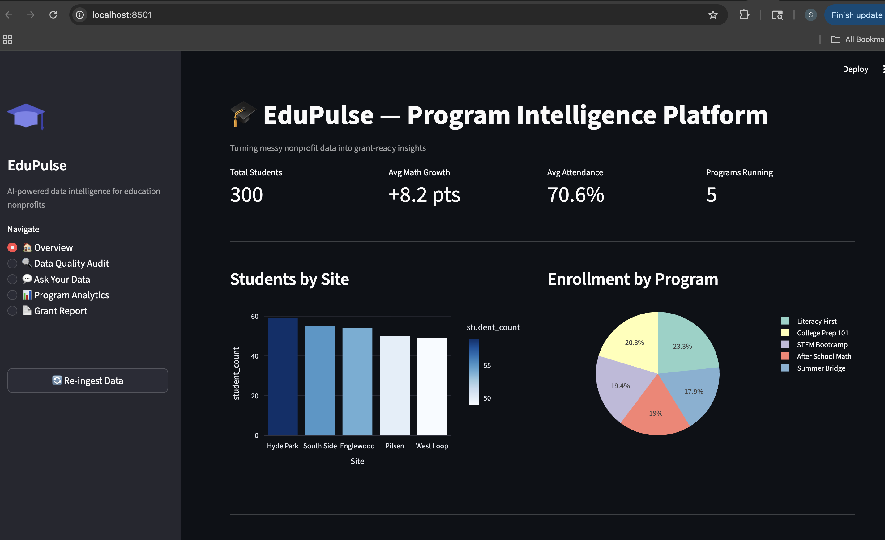
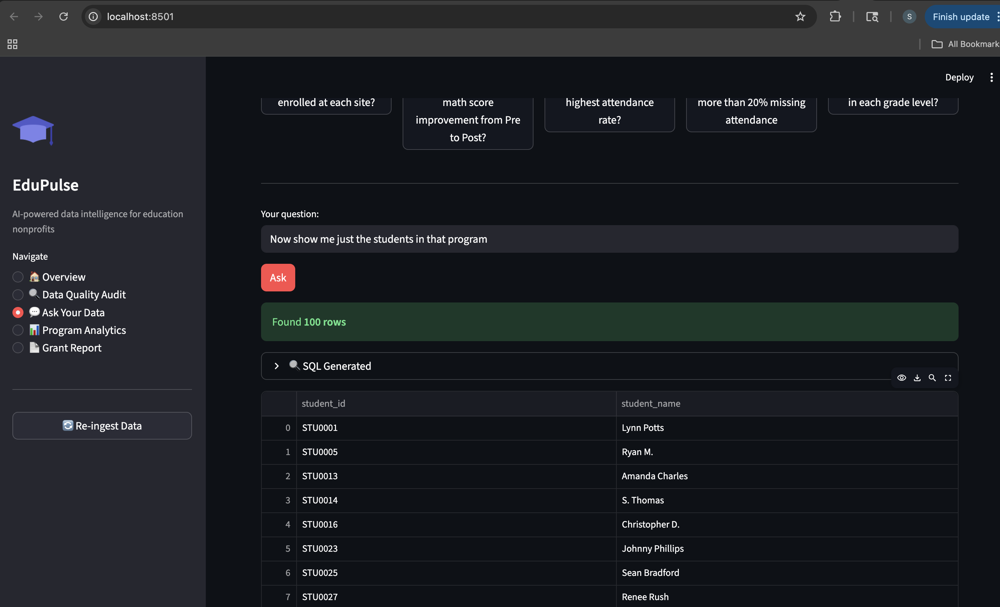
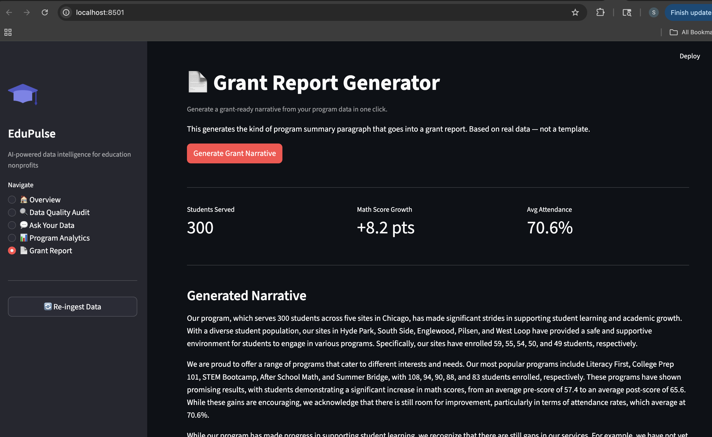
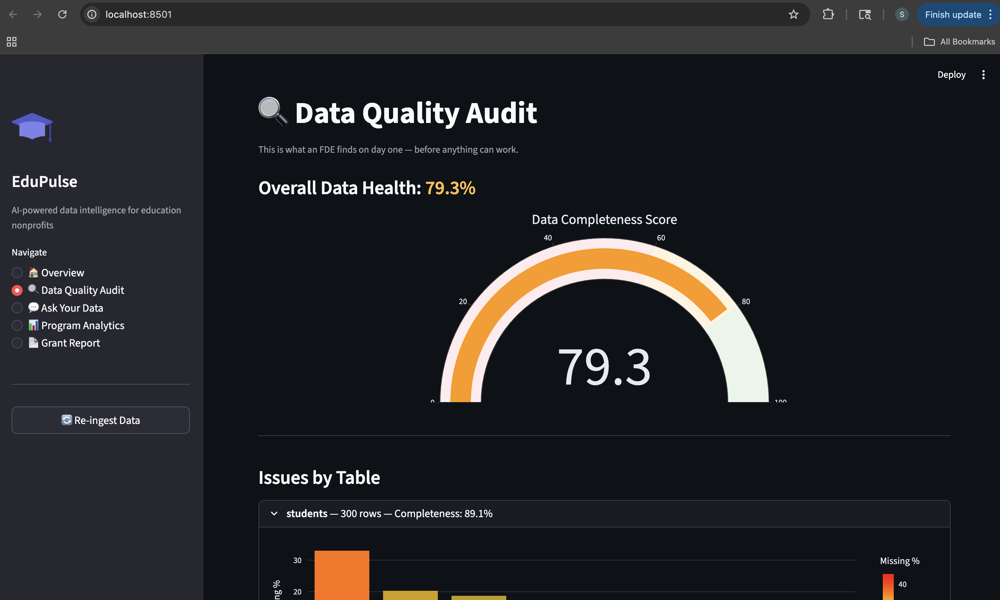

# EduPulse — AI-Powered Data Intelligence for Education Nonprofits

> Built to solve a real problem: education nonprofits are sitting on years of student data they can't use. No infrastructure, no pipelines, no way to ask questions of their own data. EduPulse changes that.

---

## The Problem This Solves

Education nonprofits collect student performance data, attendance logs, program outcomes, and grant metrics — across spreadsheets, CSVs, and manual exports. The data is messy, inconsistent, and siloed. They can't answer basic questions like *"which program drove the most math improvement?"* without hours of manual work.

This is exactly the kind of problem a Forward Deployed Engineer gets parachuted in to fix.

---

## What EduPulse Does

- **Ingests messy CSVs** — inconsistent date formats, mixed grade level values, duplicate student records, attendance rates stored as both floats and percentage strings
- **Auto-cleans the data** — deduplication, normalization, null handling, all logged in an audit trail
- **Natural language queries** — ask plain English questions, get SQL + results + auto-generated charts
- **AI-generated grant narratives** — pulls live stats and writes grant-ready program summaries
- **Data quality audit** — tells the org in plain English what's wrong with their data and what to fix

---

## Demo

| Feature | Preview |
|---|---|
| Overview Dashboard | KPIs: 300 students, +8.2pt math growth, 70.6% attendance |
| NL Query | "Which program has the highest math improvement?" → STEM Bootcamp (+9.69 pts) |
| Grant Report | AI-written 3-paragraph program narrative from live data |
| Data Quality Audit | Per-table null rates, completeness scores, LLM-narrated findings |

---

## The Data Reality (What Makes This Hard)

The synthetic dataset intentionally mirrors real nonprofit data chaos:

- Student names stored as `DOROTHY TAYLOR`, `cody ortiz`, `N. Smith`, `Hayes, Thomas`
- Dates: `August 19, 2023`, `09-23-2023`, `29 Nov 2014` — all in the same column
- Grade levels: `8th`, `Grade 10`, `senior`, `11` — four ways to say the same thing
- Attendance rate: `0.83` (float) AND `52%` (string) — same column
- ~15 duplicate student records with slightly different name formats
- 12–25% null rates across key fields
- Grants CSV uses different column names — won't join cleanly out of the box

---

## Screenshots

### Overview Dashboard

*KPIs auto-calculated from cleaned data: 300 students served across 5 Chicago sites, +8.2pt average math growth, 70.6% attendance rate. Charts generated live from SQLite — no hardcoded numbers.*

---

### Ask Your Data — Natural Language Query

*Plain English question → LLM generates SQL → query runs → results table + auto-chart rendered instantly. STEM Bootcamp shows highest math improvement at +9.69 points. The SQL is visible for transparency.*

---

### Grant Report Generator

*One click pulls live stats from the database and generates a grant-ready 3-paragraph narrative. This is what a program director would paste directly into a funder report — no editing needed.*

---

### Data Quality Audit

*Automated audit across all 6 tables. Shows completeness scores, null rates per column, and an overall data health score. The AI narrative explains issues in plain English — written for a program director, not a data engineer.*

---

## Tech Stack

| Layer | Tech |
|---|---|
| Backend | FastAPI + SQLite |
| LLM | Groq API (llama-3.1-70b) — free tier |
| NL → SQL | Schema-injected prompt + Groq inference |
| Data Cleaning | pandas + custom normalization pipeline |
| Frontend | Streamlit |
| Charts | Plotly Express |
| Infra | Docker-ready, runs locally |

---

## Architecture
Raw CSVs (messy)
→ Ingestion + Auto-cleaning pipeline (cleaner.py)
→ SQLite database (auto-created)
→ FastAPI backend (7 endpoints)
→ Groq LLM (NL→SQL + insight generation)
→ Streamlit frontend (5 pages)

---

## Running Locally

```bash
# 1. Clone and set up
git clone https://github.com/Sakshi3027/edupulse.git
cd edupulse
python -m venv venv && source venv/bin/activate
pip install fastapi uvicorn pandas httpx streamlit plotly python-multipart aiofiles faker numpy

# 2. Generate synthetic data
python scripts/generate_data.py

# 3. Set Groq API key (free at console.groq.com)
export GROQ_API_KEY=your_key_here

# 4. Start backend
uvicorn backend.main:app --reload --port 8000

# 5. Start frontend (new terminal)
streamlit run frontend/app.py --server.port 8501
```

Open `localhost:8501` → click **Re-ingest Data** → explore all 5 pages.

---

## API Endpoints

| Method | Endpoint | Description |
|---|---|---|
| POST | `/ingest` | Load CSVs, clean, write to SQLite |
| GET | `/profile` | Data quality scores per table |
| POST | `/query` | Natural language → SQL → results |
| GET | `/insights/overview` | KPIs + AI-generated narrative |
| GET | `/insights/data-quality-report` | LLM-narrated audit report |
| GET | `/schema` | Full DB schema with row counts |

---

## Why I Built This

This project came from a clear observation: the hardest part of deploying AI in real organizations isn't the model — it's the data. Nonprofits and education orgs have years of valuable program data locked in inconsistent spreadsheets with no way to query it, visualize it, or use it to write grant reports.

EduPulse is the tool an FDE would build on-site in week one: ingest whatever mess exists, clean it automatically, and give non-technical staff a way to ask questions of their own data in plain English.

---

## Author

**Sakshi Chavan** — Data Scientist & Software Engineer  
[GitHub](https://github.com/Sakshi3027) | [Email](mailto:sakshchavan30@gmail.com)
